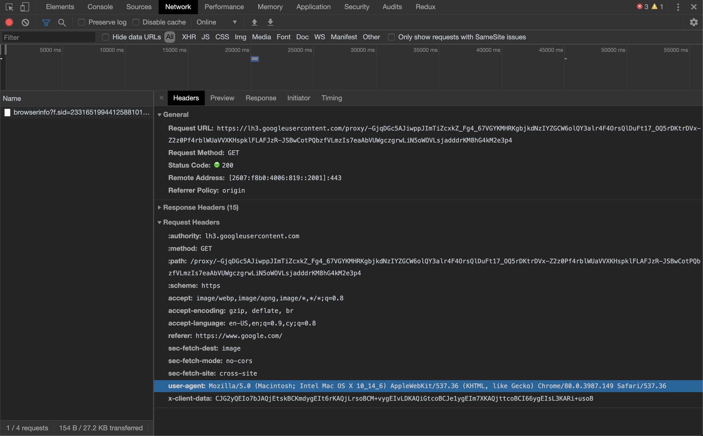

# Unit Challenge: Online Chatroom

## Overview

As you've learned, the web is a vast network of machines communicating (mostly) via HTTP requests. Whenever a client makes a request to a server, the server sends back an HTTP response, completing the cycle. When building web apps, there are many ways to instruct the browser to send an HTTP request, but modern applications rely on web APIs like fetch to send requests and receive responses _asynchronously_ in the background, without requiring a full page reload. 


In this challenge, you'll build the clientside application for an online chatroom, programming a series of HTTP requests and dynamically handling the responses in order develop a deeper understanding and familiarity with asynchronous JavaScript. 

## Additional Context

### Request

Every asynchronous request is at its core an HTTP request. The browser sends a `request` object to the server with information regarding the browser's intention with the server. There are major request types (or methods) that provide valuable information about the browsers intention:

- GET
- POST
- PUT
- DELETE

**GET** requests are primarily used for fetching data from the server. For example, when you load Instagram, your browser is making a GET request for all of your friends' latest posts to populate the news feed. **POST** requests are used to provide data to the server. Whenever you are using Messenger and you send a message - a POST request is being made by your browser to add your message the server. **PUT** requests are used to update data on the server. **DELETE** requests inform the server that some data needs to be deleted.

### HTTP Headers



In addition to the request **method**, the browser may provide additional information and instructions about its request in the form of **[request headers](https://en.wikipedia.org/wiki/List_of_HTTP_header_fields)**.

A few examples of what is provided in the HTTP headers:

- **Accept:** Informs the server what file type the browser expects to receive back from the server
- **User-Agent:** Information about the method at which the browser is communicating with the server

## Getting Started

- [ ] Fork and clone this repository. If you need a refresher, just follow the instructions found [here](https://github.com/CodesmithLLC/dev-environment-setup/blob/main/fork-clone.md)!

- [ ] Run `npm install` to install any dependencies
- [ ] Run `npm start` to start your development server

A dev server is a local development tool that automatically serves your files to the browser and refreshes when you make changes to your code. Once it's running in the background, you can visit http://localhost:5173 to preview and test your application.

NOTE: Your dev server is also handling compilation from TypeScript to JavaScript behind the scenes! Even though you won't be explicitly running the TypeScript compiler (where you would usually be alerted to type errors), your IDE will very likely display type errors via Intellisense or the Issues pane while you're working. If you run into errors, here are a few tips:

- Use type assertions when selecting DOM elements (e.g., HTMLInputElement)
- It's a great idea to define interfaces for any data structures (e.g., the message objects included on the HTTP response)

## PART 1

- [ ] Create an area on the page where chat messages can be displayed. You may create this area either statically (editing index.html directly), dynamically (by interacting with the DOM using JavaScript in src/main.ts), or with a combination of the two.

- [ ] Retrieve the list of messages from our messaging server by making a **GET** request to the following URI: `https://ohwuvawrw4.execute-api.us-west-2.amazonaws.com/messages`

NOTE: Since you are retrieving data from an external API, you may get a 'CORS' error in the browser console preventing your request from completing. This is a common hurdle in working with APIs, and there is more than one solution to be found. As always, the [MDN documentation](https://developer.mozilla.org/en-US/docs/Web/HTTP/CORS) is a good place to begin, though you may need to do additional research.

- [ ] Using JavaScript, populate your messages area with the list of messages retrieved via the HTTP request.

## PART 2

- [ ] Create a text input and submit button where users of your chatroom can enter and submit their messages.

- [ ] Post messages to the server by making a **POST** request to the same URI as above. Include a **body** with your AJAX request that includes information about your message. The body should contain the properties `created_by` and `message`. The server is expecting the body of the POST request to be encoded as **JSON**. NOTE: You may need to explicitly tell the server what type of data you're sending over!

Below is a sample message:

```json
{
  "created_by": "Alex Zai",
  "message": "Sample message"
}
```

## BONUS

These bonus objectives are opportunities to extend your learning beyond the base challenges. They can be attempted in any order, depending on what you want to focus on.

- [ ] Populating _all_ the previous messages might be overkill, cluttering your UI with unnecessary information. Develop logic to selectively render only a portion of the messages at a time, ordering them in whatever way feels most intuitive.

- [ ] Create a button that users can press in order to refresh the message feed without reloading the entire page.

- [ ] Add some styling to your chatroom and make it your own! What's the best format to display the name of the user who sent the message? What about the datetime the message was sent?
